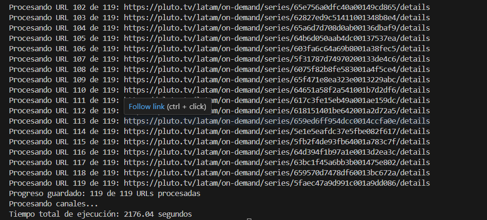
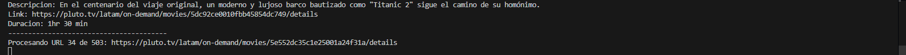

Prueba Técnica - Zalazar Matías

Descripción del Proyecto

Este proyecto es parte de una prueba técnica realizada por Zalazar Matías. El objetivo de la prueba fue extraer información detallada de los canales, series y películas disponibles en Pluto TV a través de un proceso de web scraping. La información extraída incluye detalles como títulos, géneros, descripciones, ratings, episodios, y enlaces directos.

Tecnologías Utilizadas

*Python: Lenguaje de programación principal.

*Selenium: Utilizado para automatizar la extracción de datos de sitios web.

*Google Chrome: Navegador utilizado para la automatización.

*Pandas: Usado para manipulación y almacenamiento de datos en formato CSV.

Tiempo de ejecucion:
Canales tiempo: 1774.23 segundos

Series tiempo: 2176.04 segundos

Peliculas tiempo: estimativo de 2hs (Se calcula 15s por toma debido al time.sleep)

Resultados Obtenidos

Canales(informacion_pluto_canales):
Se extrajo información detallada sobre los canales disponibles en Pluto TV. Esto incluye títulos de programas, descripcion y enlaces al canal.

Series(informacion_pluto_series):
Para las series, se extrajo Titulo, Rating, Genero, Descripcion, Temporadas, Link, Titulo Capitulo, Episodio, Duracion, Descripcion Capitulo y Link Capitulo

Peliculas(informacion_pluto_movies):
Se extrajo información detallada sobre los titulos, rating, genero, descripcion, link y duracion de cada una.